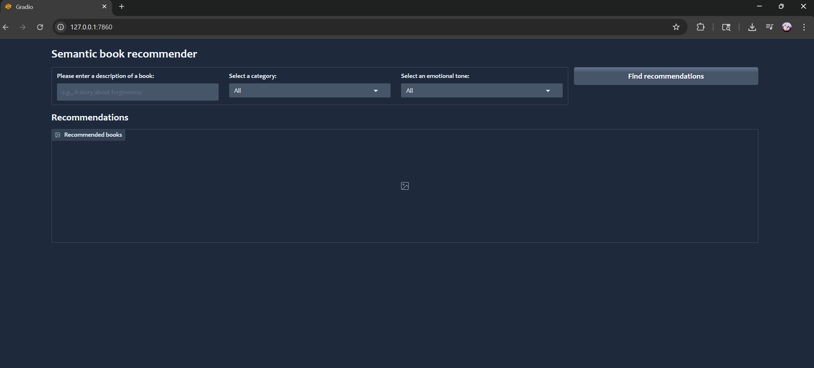
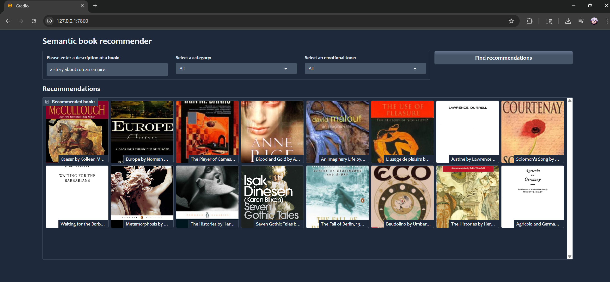

# **Smart-Book Recommendation System with LLMs and Sentiment Analysis**

This project implements a **Gradio-based book recommendation system** that uses **LLMs (Large Language Models)** and **vector search** to recommend books based on user queries. It also integrates **zero-shot text classification** and **sentiment analysis** to enhance the recommendation process.

## **Skills and Technologies Used**

- **Python**: Core language for building the application.
- **Gradio**: Framework for creating interactive web applications.
- **LangChain**: Framework to work with LLMs, providing tools for vector search, document splitting, and more.
- **OpenAI**: API for generating embeddings and using LLMs for classification and sentiment analysis.
- **Pandas**: Data manipulation and cleaning (used for reading and processing the book data).
- **Numpy**: Array and matrix operations.
- **Hugging Face**: For zero-shot classification and sentiment analysis using pre-trained models.
- **Chroma**: Vector database for fast similarity search.

## **Project Overview**

The app uses **semantic search** to recommend books based on user queries. It allows the user to input a description of a book, select an emotional tone (e.g., Happy, Angry), and filter by category. The app uses **zero-shot text classification** to classify book descriptions and **sentiment analysis** to adjust the recommendations based on the tone (e.g., recommending books with a "happy" sentiment).

## **Dashboard Screenshots**

### **Initial Dashboard**

### **After Search Dashboard**

## **Key Features**

- **Book Recommendations**: The system recommends books based on semantic similarity to the user’s input.
- **Emotional Tone Filtering**: Users can select a tone (e.g., Happy, Sad, Angry), and the app will sort the books accordingly.
- **Zero-Shot Text Classification**: Classifies book descriptions into predefined categories using a zero-shot learning approach with LLMs.
- **Sentiment Analysis**: Extracts emotions from book descriptions and adjusts recommendations based on user’s desired sentiment.

## **Project Workflow**

### 1. **Data Cleaning**:
- **Handling Missing Data**: Identify and manage missing values in the book dataset.
- **Short Description Removal**: Remove books with short or incomplete descriptions to improve recommendation quality.
- **Final Cleaning Steps**: Perform final data cleaning to prepare the dataset for embedding and classification.

### 2. **Vector Search**:
- **CharacterTextSplitter**: Split book descriptions into chunks using LangChain’s `CharacterTextSplitter` to optimize document processing.
- **Building Vector Database**: Generate embeddings for book descriptions using OpenAI’s embeddings and store them in a **Chroma vector database** for efficient similarity search.

### 3. **LLM Integration**:
- **Zero-shot Text Classification**: Use pre-trained LLMs from Hugging Face to classify book descriptions into categories without needing additional labeled data.
- **Sentiment Analysis**: Fine-tune LLMs to detect emotions in the text (e.g., happiness, anger, sadness) and adjust recommendations based on these emotions.

### 4. **Gradio Dashboard**:
- **Interactive Web Interface**: Create a **Gradio dashboard** for the book recommendation system where users can input descriptions, select categories, and filter by emotional tone.
- **Book Display**: Show book covers, titles, authors, and short descriptions as recommendations.

For The Love of Books!

